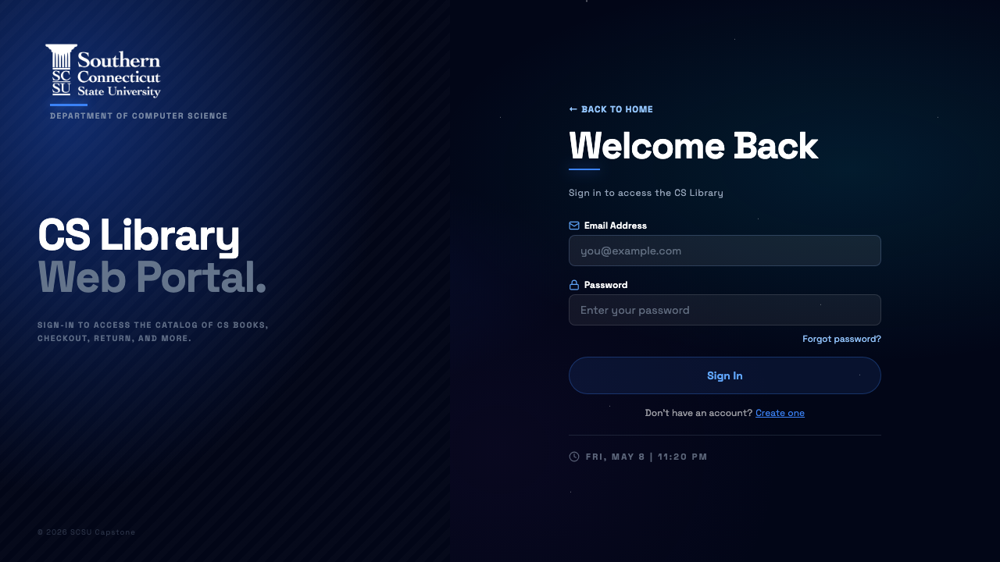
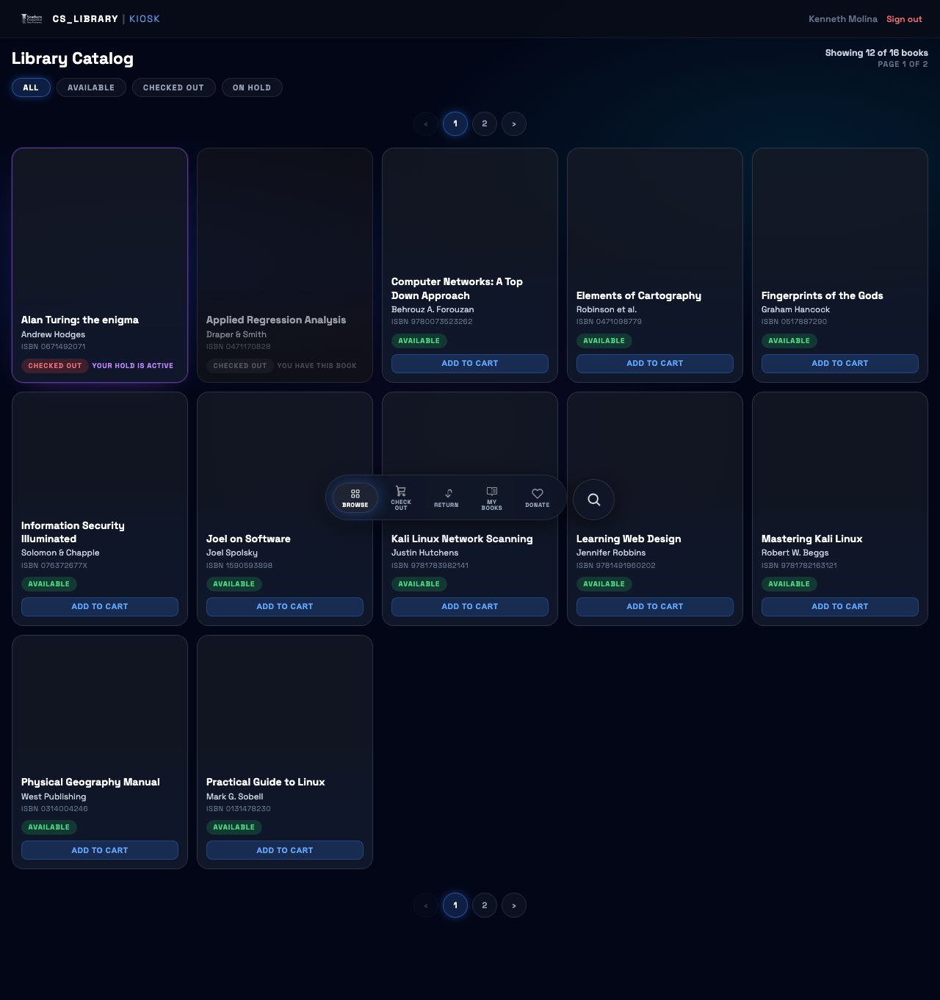
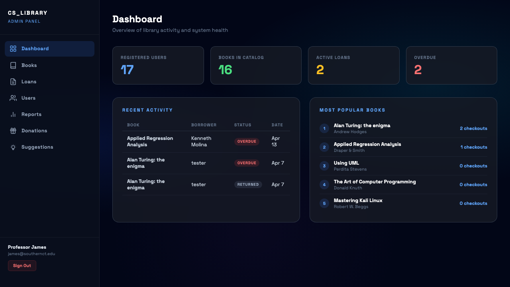

# CS Library

A full-stack library management system for the Department of Computer Science at Southern Connecticut State University. Built as a senior capstone project.


## Overview

CS Library provides two interfaces over a shared PostgreSQL database:

- **Web Portal** — Students register, browse the catalog, track their loans, and manage their account from anywhere they go. Supports local email/password login and Microsoft (Outlook) single sign-on.
- **Kiosk App** — A Raspberry Pi terminal in the CS Library where students scan their student ID to check out and return books. Communicates with the web server over a shared key, the REST API.

---

## Core Features

**Web Portal**
- Microsoft (Outlook) OAuth Ready — signs in with `@southernct.edu` accounts and automatically links the student ID from the user's Microsoft Graph
- Local email and password login - This is by default, but can be used with OAuth created accounts
- Browse the full book catalog with search, filters, and pagination
- View currently checked-out books with due dates, extension requests, overdue notices
- Account settings — view relevant account information and set or change your password
- Suggest books for the library to add
- Responsive design, works on mobile

**Kiosk App**
- Student ID login — scans barcode (or types ID)
- Browse catalog, check out books, return books, and renew loans
- Cart-based checkout with 14-day loan period
- Session-based — auto-clears after 30 minutes of inactivity
- Lightweight application that runs as a standalone Express app on the Pi, calls the web server's REST API

**Admin Panel**
- Separate login at `/admin/login` — only accessible to users with `role = admin`
- Dashboard showing live counts of users, books, and active loans
- Book management - Add, edit, enrich, and delete books in the library
- Loan Management - Track all checkout activity and view extension requests
- User Management - View account data, history, set a borrowing limit, and promote any user as an admin
- Track usage reports and view popular books that are currently in the system
- View logs of donations
- View user suggestions sent to the server
---

## Screenshots

**Web Portal Login**



**Kiosk Dashboard**



**Admin Dashboard**



---

## Architecture

```
┌─────────────────────────────┐         ┌──────────────────────┐
│       Virtual Machine       │         │    Raspberry Pi      │
│                             │         │                      │
│  src/app.ts (Express)       │◄────────│  kiosk/src/app.ts    │
│  ├── /auth/*                │  HTTPS  │  ├── Student ID login│
│  ├── /web-dashboard/*       │  + Key  │  └── Kiosk dashboard │
│  ├── /admin/*               │         └──────────────────────┘
│  └── /api/kiosk/*  ◄────────┘
│                             │
│  PostgreSQL (Cloud SQL)     │
└─────────────────────────────┘
```

The Pi never connects to the database directly. All data flows through the `/api/kiosk` REST API endpoints, authenticated with a shared `KIOSK_API_KEY`.

---

## Requirements

- Node.js LTS (v20+) — install via [nvm](https://github.com/nvm-sh/nvm)
- PostgreSQL 15+
- Git

---

## Installation

### 1. Clone the repository

```bash
git clone https://github.com/AmilcarArmmand/CS_Library_Nuc_Project.git
cd CS_Library_Nuc_Project
```

### 2. Install Node.js via nvm

```bash
curl -fsSL https://raw.githubusercontent.com/nvm-sh/nvm/v0.39.7/install.sh | bash
export NVM_DIR="$HOME/.nvm"
. "$NVM_DIR/nvm.sh"
nvm install --lts
node -v && npm -v
```

### 3. Install dependencies

```bash
npm install
```

### 4. Configure environment

```bash
cp .env.example .env
```

Open `.env` and fill in your values. At minimum:

```env
NODE_ENV=development
PORT=8000

POSTGRES_HOST=localhost
POSTGRES_PORT=5432
POSTGRES_DB=postgres
POSTGRES_USER=postgres
POSTGRES_PASSWORD=your_db_password

SESSION_SECRET=   # generate: node -e "console.log(require('crypto').randomBytes(32).toString('hex'))"
KIOSK_API_KEY=    # generate: node -e "console.log(require('crypto').randomBytes(32).toString('hex'))"

MICROSOFT_CLIENT_ID=        # from Azure Portal
MICROSOFT_CLIENT_SECRET=    # from Azure Portal
MICROSOFT_CALLBACK_URL=http://localhost:3000/auth/microsoft/callback
```

### 5. Set up the database

```bash
npm run db:generate   # generate migration files from schema
npm run db:migrate    # apply migrations to PostgreSQL
```

### 6. Seed sample data (optional)

Adds 16 books and 3 test accounts to the database. Safe to re-run.

```bash
npx tsx src/mock-data.ts
```

Local-only test credentials after seeding, as defined in mock-data.ts. These are
development fixtures and must not be reused for production accounts:

```bash
const TEST_USERS = [
  { studentId: "40000", name: "Nisreen Cain",     email: "cainn3@southernct.edu", password: "changeme123" },
  { studentId: "10101", name: "Amilcar Armmand",  email: "armmanda1@southernct.edu",    password: "changeme123" },
  { studentId: "12345", name: "Kenneth Molina",  email: "molinak4@southernct.edu",    password: "changeme123" },
  { studentId: "11111", name: "Jose Gaspar",     email: "gasparmarij1@southernct.edu", password: "changeme123" },
  { studentId: "99999", name: "Professor James", email: "james@southernct.edu",         password: "changeme123" },
];
```
### 7. Build and run

```bash
npm run build && npm start
```

Or for development with hot reload:

```bash
npm run dev
```

Open your browser to `http://localhost:8000`

---

## Kiosk Setup (Raspberry Pi)

### 1. Navigate to the kiosk directory

```bash
cd kiosk
```

### 2. Install dependencies

```bash
npm install
```

### 3. Configure environment

```bash
cp .env.example .env
```

Fill in `kiosk/.env`:

```env
CLOUD_HOST=your-server-ip-or-domain
CLOUD_PORT=3000
CLOUD_PROTOCOL=http
CLOUD_API_KEY=   # must match KIOSK_API_KEY on the server

KIOSK_SESSION_SECRET=   # any random string
KIOSK_PORT=8080
```

### 4. Build and run

```bash
npm run build && npm start
```

The kiosk UI is accessible at `http://localhost:8080`. On the Pi, configure Chromium to open this URL on boot in kiosk mode:

```bash
# Add to /etc/xdg/lxsession/LXDE-pi/autostart
@chromium-browser --kiosk --noerrdialogs http://localhost:8080
```

---

## Deployment (For the SCSU Web Space)

### First-time setup on the VM

```bash
ssh user@scsu-server
cd /opt/app
git clone https://github.com/AmilcarArmmand/CS_Library_Nuc_Project.git .
cp .env.example .env
nano .env   # fill in production values
chmod +x deploy.sh stop.sh status.sh
./deploy.sh
```

### Updating the server

```bash
ssh user@your-server
cd /opt/app
git pull
./deploy.sh
```

### Useful commands

```bash
./status.sh              # check if web server and kiosk are running
./stop.sh                # stop both processes
tail -f web.log          # live web server logs
tail -f kiosk.log        # live kiosk logs
```

---

## Admin Access

Promote any registered user to admin:

```bash
npx tsx src/tools/make-admin.ts user@example.com
```

The admin panel is at `/admin/login` — separate from the main web login. Regular users attempting to access `/admin` will receive a 403 error.

---

## Available Scripts

| Script | Description |
|---|---|
| `npm run dev` | Start development server with hot reload |
| `npm run build` | Compile TypeScript to `dist/` |
| `npm start` | Start production server from `dist/` |
| `npm run db:generate` | Generate Drizzle migration files from schema |
| `npm run db:migrate` | Apply migrations to PostgreSQL |
| `npx tsx src/mock-data.ts` | Seed sample books and test accounts |
| `npx tsx src/tools/make-admin.ts <email>` | Promote user to admin |

---

## Credits

Developed by the SCSU CS Capstone Team — Spring 2026.

- **Amilcar Armmand** — Project Lead, hardware integration, database and deployment coordination
- **Jose Gaspar Marin** — Web frontend, backend admin tools, catalog management, reports, donations, and suggestions
- **Kenneth Molina** — Web frontend, kiosk interface, scanner-friendly circulation workflows, and demo validation

Built with [Express](https://expressjs.com), [Drizzle ORM](https://orm.drizzle.team), [Passport.js](https://www.passportjs.org), and [EJS](https://ejs.co).
