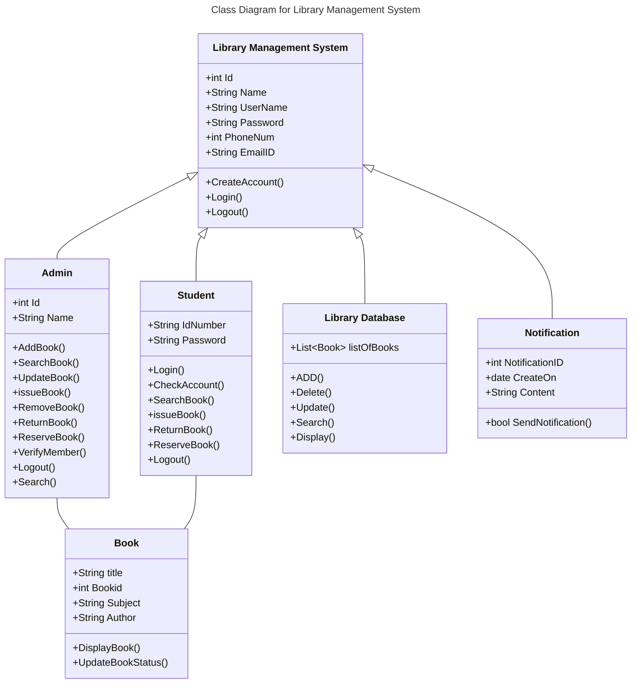

# CS Library Management System

```mermaid
---
title: Class Diagram for Library Management System
---
classDiagram
    `Library Management System` <|-- Student
    `Library Management System` <|-- Admin
    `Library Management System` <|-- `Library Database`
    `Library Management System` <|-- Notification
    Admin -- Book
    Student -- Book
    class `Library Management System`{
        +int Id
        +String Name
        +String UserName
        +String Password
        +int PhoneNum
        +String EmailID
        +CreateAccount()
        +Login()
        +Logout()
    }
    class Student{
        +String IdNumber
        +String Password
        +Login()
        +CheckAccount()
        +SearchBook()
        +issueBook()
        +ReturnBook()
        +ReserveBook()
        +Logout()
    }
    class `Admin`{
        +int Id
        +String Name
        +AddBook()
        +SearchBook()
        +UpdateBook()
        +issueBook()
        +RemoveBook()
        +ReturnBook()
        +ReserveBook()
        +VerifyMember()
        +Logout()
        +Search()
    }
    class Book{
        +String title
        +int Bookid
        +String Subject
        +String Author
        +DisplayBook()
        +UpdateBookStatus()
    }
    class `Library Database`{
        +List~Book~ listOfBooks
        +ADD()
        +Delete()
        +Update()
        +Search()
        +Display()
    }
    class Notification {
        +int NotificationID
        +date CreateOn
        +String Content
        +bool SendNotification()
    }

```
