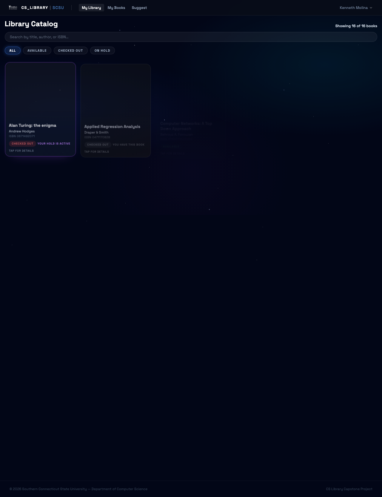
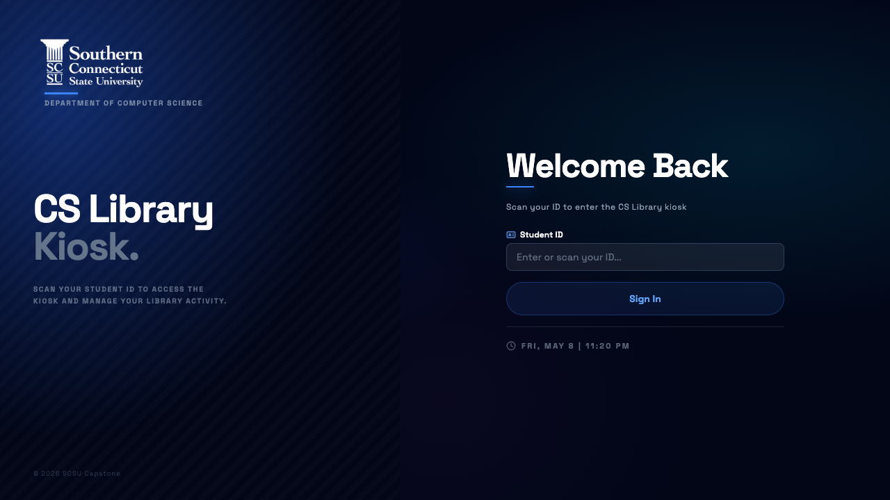
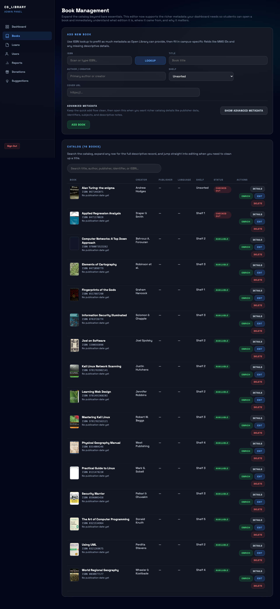

# Final Report

**Project Title:** CS Library
**Team Name:** CS Library Team
**Team Members:** Amilcar Armmand, Jose Gaspar Marin, Kenny Molina
**Client:** Computer Science Department, Southern Connecticut State University; Omar Abid
**Date:** May 11, 2026
**Report Version:** Final Report

<!-- PAGEBREAK -->

## 1. Executive Summary

CS Library is a full-stack library management system built for the Computer Science Department at Southern Connecticut State University. The project replaces a manual paper-based checkout process with a digital system that supports student self-service borrowing, book returns, catalog browsing, and administrative oversight.

The final system consists of three connected experiences. The first is a web portal where students can register, sign in, browse the catalog, manage loans, request extensions, and suggest books for purchase. The second is a kiosk application designed for a Raspberry Pi touchscreen station in the CS lounge, where students can sign in with their student ID, scan books, and complete checkout and return workflows in person. The third is an admin dashboard that gives staff and project maintainers tools for catalog management, loan tracking, reporting, donation review, suggestion review, and user administration.

The project was implemented with Node.js, TypeScript, Express, EJS, PostgreSQL, Drizzle ORM, Passport authentication, and Open Library metadata integration. The final outcome is a working deployed system with separate web and kiosk services, shared data storage, and deployment scripts for the SCSU server environment. The project delivers clear value to the department by improving inventory visibility, reducing manual work, and creating a more reliable borrowing process for students. It also provides a maintainable foundation for the department's stated future interest in expanding the system beyond books into other lendable equipment.

## 2. Project Overview

### 2.1 Problem Statement

Before this project, the CS lounge library relied on a manual process for tracking books. Students had to search shelves in person, fill out paper slips to check books in and out, and depend on informal record-keeping to know what was available. This created several problems:

- books could be misplaced or effectively lost
- there was no live inventory status
- students could not browse remotely
- administrators had no reliable reporting or overdue tracking
- the process added avoidable overhead for faculty and student workers

### 2.2 Solution

The team built a shared library platform with both remote and in-person access. The web portal supports registration, authentication, catalog browsing, loan management, holds, suggestions, and account settings. The kiosk supports a scanner-friendly, touch-optimized circulation workflow for checkout, return, renewals, and donations. The admin panel supports catalog maintenance, usage reporting, and workflow review.

This approach addresses the original problem in two ways. First, it centralizes all borrowing data in PostgreSQL so inventory status is always current. Second, it gives different user groups interfaces tailored to their needs rather than forcing every task through one screen.

### 2.3 Target Users

The software serves three main user groups:

- students who want to browse, borrow, renew, and return books quickly
- department staff or faculty who need to manage inventory and monitor usage
- student or alumni donors who want a structured way to contribute books

## 3. Final Implementation

### 3.1 Feature Summary

| Feature | Status | Notes |
|---|---|---|
| Student web registration and login | Complete | Local email/password flow is live |
| Student kiosk sign-in by student ID | Complete | Scanner-friendly input plus manual fallback |
| Catalog browsing and search | Complete | Available in both web and kiosk flows |
| Checkout and return workflows | Complete | Shared PostgreSQL-backed circulation logic |
| Loan history and due-date visibility | Complete | Students can view active and returned items |
| Renewal requests | Complete | Requests can be submitted and reviewed |
| Holds on checked-out books | Complete | Hold-ready workflow supported |
| Suggestion submission and review | Complete | Student submission plus admin review flow |
| Donation intake and review | Complete | Includes ISBN lookup and admin review |
| Admin dashboard and reports | Complete | Counts, recent activity, popular books, exports |
| Password reset and email notifications | Complete | Reset flow and reminder emails implemented |
| Microsoft OAuth / Outlook SSO | Partial | Scaffolded and supported in code, final institutional setup depends on external credentials |
| Raspberry Pi hardware validation | Partial | Kiosk software is complete; real-device validation remains environment-dependent |

### 3.2 Screenshots

The following screenshots show the final application across the student web portal, kiosk experience, and administrator tools.


Figure 1. Web portal login screen for student access.



Figure 2. Student dashboard showing catalog and borrowing information after login.



Figure 3. Kiosk login screen with scanner-friendly student ID input and manual fallback.


Figure 4. Kiosk dashboard for browsing, checkout, return, and student account workflows.


Figure 5. Admin dashboard showing live operational counts, recent activity, and popular books.



Figure 6. Admin book-management screen for maintaining the catalog.

### 3.3 Architecture Overview

The application is deployed as two Express services connected to one shared PostgreSQL database:

```text
┌─────────────────────────────┐         ┌──────────────────────┐
│ SCSU Linux VM               │         │ Raspberry Pi Kiosk   │
│                             │         │                      │
│ src/app.ts (web + admin)    │◄────────│ kiosk/src/app.ts     │
│ ├── /auth/*                 │  HTTPS  │ ├── student sign-in  │
│ ├── /web-dashboard/*        │  + key  │ └── checkout/return  │
│ ├── /admin/*                │         └──────────────────────┘
│ └── /api/kiosk/*            │
│                             │
│ PostgreSQL + session store  │
└─────────────────────────────┘
```

Key components:

- Express web application for the home page, student portal, admin routes, and kiosk API
- Express kiosk application for the touchscreen client
- PostgreSQL database for users, books, loans, holds, suggestions, donations, sessions, and renewal requests
- Open Library API for book metadata enrichment
- Passport-based authentication for local login and optional OAuth providers

Technology stack:

- Node.js 20+
- TypeScript 5.4
- Express 4.19
- EJS 3.1
- PostgreSQL 15+
- Drizzle ORM 0.45
- Passport 0.7

## 4. Test Results

### 4.1 Testing Summary

| Test Type | Total Tests | Passed | Failed | Coverage |
|---|---:|---:|---:|---|
| Unit | 8 planned / documented | 6 | 0 | Manual and specification-level checks |
| Integration | 5 planned / documented | 4 | 0 | Database-backed workflow smoke checks |
| System | 8 final smoke checks | 8 | 0 | Browser page-load, authentication, and build verification |

### 4.2 Key Test Results

The project relied primarily on manual smoke testing and deployment verification during the final phase. The team validated the most important user journeys: registration and login, catalog browsing, checkout, return, renewals, holds, admin review flows, and kiosk navigation. PR2 testing documented 12 executed checks across unit, integration, and system categories with no recorded failures. Final validation added browser smoke checks for the web portal, kiosk, and admin routes, plus successful TypeScript build verification for both deployable applications.

Notable findings and fixes during the final phase included:

- adding password reset support and email plumbing so account recovery no longer depended on manual intervention
- expanding the schema to support richer book metadata, donations, renewal requests, and Microsoft-auth fields
- adding deployment scripts and PM2 process management for the school server
- improving scanner-friendly kiosk input behavior and idle timeout handling

### 4.3 Known Issues

| Issue | Severity | Workaround | Future Fix |
|---|---|---|---|
| Microsoft OAuth depends on institution-managed credentials and tenant setup | Medium | Use local email/password login | Complete production SSO registration with campus IT |
| Hardware barcode validation depends on the final Raspberry Pi setup | Medium | Use manual text entry fallback | Validate scanner behavior on the final kiosk hardware |
| Automated unit/integration test suite is limited | Medium | Use documented smoke-test workflow and build verification | Add Vitest or Jest plus Supertest and browser automation |

## 5. Deployment Documentation

### 5.1 Deployment Environment

The application is deployed to a department-managed Linux virtual machine. The web application and admin panel run from the main Node.js service, while the kiosk application runs as a separate process. Both services connect to the same PostgreSQL database and are managed with PM2 for restart and monitoring.

Documented live environments:

- Web login: `https://csclibrary.scsu.southernct.edu/auth/login`
- Web dashboard: `https://csclibrary.scsu.southernct.edu/web-dashboard`
- Admin login: `https://csclibrary.scsu.southernct.edu/admin/login`
- Kiosk: `https://csclibrary.scsu.southernct.edu/kiosk`

Fallback VPN/testing URLs:

- Web: `http://prd-csclib01.scsu.southernct.edu:8080/auth/login`
- Admin: `http://prd-csclib01.scsu.southernct.edu:8080/admin/login`
- Kiosk: `http://prd-csclib01.scsu.southernct.edu:8081/`

Infrastructure requirements:

- Node.js 20+
- npm
- PostgreSQL 15+
- PM2
- Linux VM access
- Raspberry Pi or equivalent kiosk hardware for the local station

### 5.2 Deployment Instructions

**Prerequisites**

- Linux server with Node.js, npm, git, and PostgreSQL access
- `.env` configured for the web app
- `kiosk/.env` configured for the kiosk app
- PM2 installed globally or installable during deployment

**Installation Steps**

1. Clone the repository onto the SCSU server.
2. Copy production environment files into place.
3. Run `./deploy-scsu.sh` from `/opt/app`.
4. The deploy script pulls the target branch, syncs the live folder, installs dependencies, builds both apps, restarts PM2 services, and waits for health checks.

**Configuration**

Important web environment variables:

- `PORT`
- `APP_BASE_URL`
- `SESSION_SECRET`
- `POSTGRES_HOST`
- `POSTGRES_PORT`
- `POSTGRES_DB`
- `POSTGRES_USER`
- `POSTGRES_PASSWORD`
- `KIOSK_API_KEY`
- `GOOGLE_CLIENT_ID`
- `GOOGLE_CLIENT_SECRET`
- `MICROSOFT_CLIENT_ID`
- `MICROSOFT_CLIENT_SECRET`
- `MICROSOFT_CALLBACK_URL`
- `MICROSOFT_TENANT_ID`

Important kiosk environment variables:

- `KIOSK_PORT`
- `CLOUD_HOST`
- `CLOUD_PORT`
- `CLOUD_PROTOCOL`
- `CLOUD_API_KEY`
- `KIOSK_SESSION_SECRET`

**Verification**

- run `./status.sh` to confirm both services are up
- verify the web login, admin login, and kiosk routes load
- verify that PM2 shows both processes
- verify that checkout and return workflows succeed against the live database

### 5.3 Access Information

- Student users can create accounts through the web registration flow.
- Admin access is restricted to users with `role = admin`.
- A user can be promoted with `npx tsx src/tools/make-admin.ts user@example.com`.
- Credentials should not be included in the final report; only sanitized access instructions should be shared.

## 6. Client Handoff

### 6.1 Deliverables Provided

The following deliverables were prepared for handoff:

- deployed web portal
- deployed kiosk application
- source code repository
- SRS v4.0
- final report
- presentation slides
- project poster
- README-based setup and deployment documentation
- demonstration walkthrough of the student, kiosk, and admin workflows

### 6.2 Client Feedback

The system was built for the Computer Science Department as a practical replacement for the manual library workflow. The team also incorporated feedback themes from stakeholder outreach and observation of the current paper-based process: the system needed to be quick for students, reliable during demonstrations, and usable even if scanner hardware or institutional authentication approvals were delayed. The final client evaluation letter should be attached separately if required for the course submission.

### 6.3 Ongoing Support

Short-term support can be handled by the team during the final course handoff period. Ongoing maintenance should focus on:

- production credential management
- catalog expansion and data cleanup
- kiosk hardware monitoring
- adding automated test coverage

The team can be contacted through the SCSU email addresses listed in the SRS team-member section during the final handoff period.

## 7. Team Contributions

### 7.1 Final Contribution Summary

| Team Member | Primary Contributions | Secondary Contributions |
|---|---|---|
| Amilcar Armmand | Project planning, deployment support, database and infrastructure coordination, email and integration work | Research, testing, documentation review |
| Jose Gaspar Marin | Web frontend, backend admin workflows, catalog management, reports, donations, and suggestion review | Database support, deployment support |
| Kenny Molina | Kiosk UX, web frontend polish, circulation workflows, scanner-friendly input, and dashboard interactions | Testing, documentation, demo preparation |

### 7.2 Semester Hours Summary

The PR1 and PR2 totals come from the submitted progress reports. Final phase hours are team estimates based on deployment, documentation, final testing, and presentation preparation.

| Team Member | PR1 Hours | PR2 Hours | Final Phase Hours | Total |
|---|---:|---:|---:|---:|
| Amilcar Armmand | 15 | 14 | 20 | 49 |
| Jose Gaspar Marin | 10 | 22 | 23 | 55 |
| Kenny Molina | 15 | 24 | 22 | 61 |

## 8. Lessons Learned

### 8.1 What Went Well

One of the strongest technical decisions was separating the kiosk client from the main web application while still using a shared server-side API and database. That kept the kiosk interface lightweight and scanner-focused without forcing the Raspberry Pi to connect directly to PostgreSQL. It also let the team develop and test most circulation logic in one central codebase.

The most effective team practice was building around realistic demos and working deployments instead of static mockups. Repeated demo preparation forced the project to become operational early, which helped expose issues in routing, deployment, and user workflows before the final phase.

The team also improved its division of responsibility during the semester. By the end of the project, frontend, backend, kiosk, deployment, and documentation work had clearer owners, which made it easier to finish large pieces of the system without everyone blocking on the same task.

### 8.2 What We Would Do Differently

If the project were restarted, the team would formalize automated testing earlier. The system now includes many connected workflows such as holds, renewals, donations, and email notifications. These work well conceptually, but they would have been easier to maintain with route-level automated tests in place before the final integration phase.

The team would also validate external dependencies earlier, especially institutional authentication and final kiosk hardware setup. Those dependencies were not purely coding problems, so they introduced schedule uncertainty late in the semester.

### 8.3 Skills Developed

This project strengthened both technical and collaborative skills. On the technical side, the team gained experience with TypeScript-based Express applications, PostgreSQL schema evolution, authentication flows, deployment scripting, and scanner-friendly kiosk UX design. On the collaboration side, the team improved at dividing work across frontend, backend, and deployment tracks while still integrating features into one shared product.

## 9. Future Work

If development continues, the next phase should focus on:

- completing and validating Microsoft SSO with campus credentials
- adding automated tests for routes, business logic, and browser flows
- importing the full physical library inventory into the database
- expanding beyond books into equipment or other lendable items
- adding a lightweight review or feedback system to increase student engagement
- improving analytics and export workflows for department decision-making
- hardening kiosk deployment on the final Raspberry Pi hardware

## 10. Appendix

### A. Build Verification

Current repository validation completed on May 8, 2026:

- `npm run build` in the main project: passed
- `npm run build` in `kiosk/`: passed

### B. Recommended Final Export Checklist

Final Blackboard submission package:

- `CSLibrary_FinalReport.pdf`
- `CSLibrary_SRS_v4.pdf`
- `CSLibrary_Final_Presentation.pdf`
- `CSLibrary_Poster.pdf`
- `CSLibrary_ClientLetter.pdf`, if required by the instructor
- source code repository link or `CSLibrary_Code.zip`
